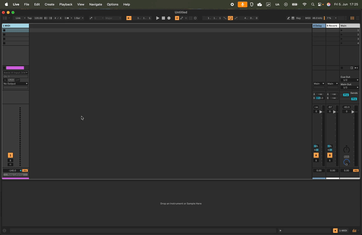
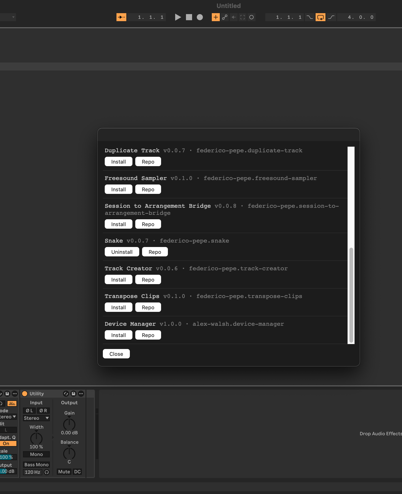

# cmdAbl

A command palette for Ableton Live.

Press `:` while Live is focused to open a
keyboard-driven command input with fuzzy filtering, tab completion, and POSIX-style flag arguments.
You are invited to add your own extensions as registered commands.

- [How it works](#how-it-works)
- [Installation](#installation)
- [Adding your extension to pakabl](#pakabl-index)
- [Development](#development)
- [Scripts](#scripts)
- [Project structure](#project-structure)

<figure>

<figcaption>open the manual with help command</figcaption>
</figure>

---

<details id="how-it-works" open>
<summary><b>How it works</b></summary>
<br>

cmdAbl registers a persistent HTTP server inside the extension host. Karabiner Elements watches
for `:` while Ableton is frontmost and fires a `curl` request to that server, which opens the
command palette modal. Commands are registered in TypeScript and injected into the UI at open
time, so the palette always reflects the live command set.

**Palette keybindings**

| Key       | Action                                |
| --------- | ------------------------------------- |
| Type      | Filter commands / flags               |
| `Tab`     | Complete selected item into the input |
| `Enter`   | Execute selected command              |
| `↑` / `↓` | Navigate the list                     |
| `Esc`     | Close without executing               |

**Command syntax**

Commands follow a POSIX-style flag pattern:

```
commandName [--flag]
```

Typing a command name followed by a space switches the dropdown into flag-completion mode.

**Built-in commands**

| Command          | Description                                                |
| ---------------- | --------------------------------------------------------- |
| `help`           | Open the Ableton Live manual in the browser               |
| `cmdabl --setup` | Install the keyboard trigger rule and show a result dialog |
| `pakabl list`    | Browse and install community extensions — see _Install more extensions with `pakabl`_ under Installation |

**Default modules**

cmdAbl ships with a few small built-in modules (`src/modules/`) that double as examples for
your own:

| Module    | Capability                                                                 |
| --------- | -------------------------------------------------------------------------- |
| `goto`    | Surfaces tracks/devices in the palette and selects them via the Remote Script bridge |
| `mute`    | `mute <path>[, <path> …]` — toggle mute on one or more tracks by path       |
| `solo`    | `solo <path>[, <path> …]` — toggle solo on one or more tracks by path       |
| `history` | Remembers your last 20 invocations and re-offers them as rerunnable entries |
| `pakabl`  | Install/update/uninstall community extensions — see _Install more extensions with `pakabl`_ |

**Live objects**

The palette also fuzzy-searches the current Set. Type part of a track name and
hit enter to select that track. The track list is snapshotted each time the
palette opens.

> **Note:** selecting a track requires the companion **cmdAbl Remote Script**
> (the Extensions SDK cannot change Live's selection). See _Remote Script
> bridge_ under Installation. Without it, the palette still opens and runs
> commands — only track selection is a no-op.

</details>

---

<details id="installation" open>
<summary><b>Installation</b></summary>
<br>

**Prerequisites**

| Platform | Required                                                                                               |
| -------- | ------------------------------------------------------------------------------------------------------ |
| macOS    | [Ableton Live 12](https://www.ableton.com) · [Karabiner-Elements](https://karabiner-elements.pqrs.org) |
| Windows  | [Ableton Live 12](https://www.ableton.com) · [AutoHotkey v2](https://www.autohotkey.com)               |

> **Platform note:** cmdAbl has only been tested on macOS so far — the Windows paths and
> setup flow (`%APPDATA%\Ableton\Live Extensions`, the AutoHotkey trigger, the Remote Script
> location) are implemented but unverified on a real Windows machine. If you develop on
> Windows and want to help, trying the install/setup flow and
> [opening an issue](https://github.com/MarvinHauke/cmdAbl/issues) with what you find
> (or a PR with fixes) would be very welcome.

**1. Install the extension**

Download the latest `.ablx` file and double-click it — Ableton Live installs and loads the extension automatically.

**2. Open the palette**

Right-click any clip, track, clip slot, or scene and choose **: cmdAbl**.

**3. Set up the `:` keyboard shortcut**

Run the following command in the palette — it both links the keyboard trigger
**and** copies the companion Remote Script into place for step 4 below:

```
cmdabl --setup
```

<details>
<summary><b>macOS</b></summary>
<br>

Make sure [Karabiner-Elements](https://karabiner-elements.pqrs.org) is installed first.
A feedback dialog confirms whether the rule was linked or shows an error. Then open
**Karabiner-Elements → Complex Modifications → Add rule** and enable
**"Open cmdAbl command palette with ':' when Ableton Live is focused"**.



> **Keyboard layout note:** The rule maps `Shift+Period` (`:` on QWERTZ/German layouts).
> If you use a different layout, edit `karabiner/cmdabl.json` and change `"key_code"` to
> match your key — use Karabiner's Event Viewer to find the correct code.

</details>

<details>
<summary><b>Windows</b></summary>
<br>

Make sure [AutoHotkey v2](https://www.autohotkey.com) is installed first. A feedback
dialog confirms the script was copied to your startup folder. Open `cmdabl.ahk` manually
to activate it immediately, or restart Windows to auto-start it.

</details>

**4. Link the Remote Script (enables track selection)**

Selecting a track from the palette needs a small companion Remote Script, because Live's
Extensions SDK has no API to change the selection itself — `cmdabl --setup` (step 3) already
copied it into Live's User Library for you:

- **macOS:** `~/Music/Ableton/User Library/Remote Scripts/cmdAbl`
- **Windows:** `~/Documents/Ableton/User Library/Remote Scripts/cmdAbl`

Copying the files isn't enough on its own — Live also needs to be told to *load and connect*
to the script, and that's a one-time **manual link** with no API to automate it:

1. **Restart Live** so it picks up the new Remote Script (a copy alone doesn't load it).
2. Open **Settings → Link, Tempo & MIDI → MIDI**, and under **Control Surface** pick
   **cmdAbl** (leave Input/Output set to _None_). This is the actual "linking" step —
   it tells Live which Control Surface script to run and connect to the palette's bridge.

Live's log will show `cmdAbl bridge listening on 127.0.0.1:27185` once the link is active.
Without it, the palette still opens and runs commands — only track selection is a no-op.

**5. Install more extensions with `pakabl`**

cmdAbl bundles `pakabl`, a small package manager for a curated list of community extensions.
Run `pakabl update` once to fetch the index, then browse and manage extensions entirely from
the palette:

| Command                          | What it does                                                                |
| -------------------------------- | --------------------------------------------------------------------------- |
| `pakabl list`                    | Browse the curated list in a UI — Install / Update / Uninstall, or jump to each extension's repo, all with one click |
| `pakabl install <id>`            | Download and install one extension by id (e.g. `federico-pepe.snake`)       |
| `pakabl update`                  | Refresh the cached curated index                                            |
| `pakabl upgrade <id>@<version>`  | Re-install a specific version                                               |
| `pakabl uninstall <id>`          | Remove an installed extension                                               |


<figcaption><code>pakabl list</code>: each entry's button reflects its install status (Install / Update / Uninstall), with a Repo button to jump to its source.</figcaption>

As with any `.ablx`, **restart Live** after installing, upgrading, or uninstalling for the
change to take effect.

</details>

---

<details id="pakabl-index" open>
<summary><b>Adding your extension to pakabl</b></summary>
<br>

`pakabl`'s curated list is just a JSON file in this repo, [`pakabl/index.json`](pakabl/index.json),
fetched by `pakabl update` and read by `pakabl list`/`install`/`upgrade`. To get your own
extension listed, open a pull request adding an entry:

```json
{
  "id": "your-author-slug.your-extension-slug",
  "name": "Your Extension",
  "version": "1.0.0",
  "url": "https://github.com/<owner>/<repo>/releases/download/v1.0.0/<file>.ablx"
}
```

| Field     | Meaning                                                                                                                                                                                |
| --------- | -------------------------------------------------------------------------------------------------------------------------------------------------------------------------------------- |
| `id`      | **Must match the folder name Live creates when it installs your `.ablx`** — `<author-slug>.<name-slug>`, i.e. your `manifest.json`'s `author` and `name` fields, lowercased with spaces replaced by hyphens (e.g. author `"Marvin Hauke"` + name `"cmdabl"` → `marvinhauke.cmdabl`). `pakabl install`/`upgrade` use this id both to look your entry up and to detect/compare an existing install — a mismatch means version checks silently fail. Double-check against the actual installed folder name on disk, not just a guess from the pattern (one curated entry has author `"Federico"` rather than `"Federico Pepe"`, producing `federico.doom` instead of the expected `federico-pepe.doom`). |
| `name`    | Free-form display name shown in `pakabl list` and feedback messages — usually your `manifest.json`'s `name`.                                                                            |
| `version` | The exact version string from your `manifest.json`. `pakabl install` compares this against an existing install to report "already installed" vs. "update available", and `upgrade`/`update` (via `pakabl list`'s "Update" button) re-validate against it before downloading — keep it in sync with each release. |
| `url`     | A direct, stable download link to the `.ablx` for that version — either a GitHub Release asset (`.../releases/download/<tag>/<file>.ablx`) or a raw repo file (`https://raw.githubusercontent.com/<owner>/<repo>/<branch>/<path>/<file>.ablx`). Both are fetched identically with a plain HTTP GET; `pakabl list`'s "Repo" button also derives your project's GitHub page from this URL, so it must point at a `github.com` or `raw.githubusercontent.com` path that starts with `<owner>/<repo>/…`. |

Bump `version` (and add a new `url`) in the same PR whenever you cut a new release — `pakabl
update` only ever overwrites its cache with whatever the index currently says, so an out-of-date
entry means users get stuck on an old version or a version-mismatch nudge toward `upgrade`.

</details>

---

<details id="development" open>
<summary><b>Development</b></summary>
<br>

**1. Install dependencies**

```sh
npm install
```

**2. Run the extension in dev mode**

```sh
npm start
```

This type-checks, bundles, and loads the extension into Ableton's Extension Host with live reload.

**3. Add commands**

All commands are registered on the `CommandRegistry` instance in `src/extension.ts`:

```ts
registry.register("mycommand", "description shown in the palette", (flags) => {
  // flags is string[] of everything typed after the command name
});

// with declared flags for tab-completion:
registry.register(
  "mycommand",
  "description",
  [{ name: "--option", description: "what this flag does" }],
  (flags) => {
    if (flags.includes("--option")) {
      /* ... */
    }
  },
);
```

Extensions must export an `activate(context: ActivationContext)` function.

</details>

---

<details id="scripts" open>
<summary><b>Scripts</b></summary>
<br>

```sh
npm start          # type-check, build (dev), and run in Live's Extension Host
npm run package    # production build + create a .ablx archive (includes karabiner/ and windows/)
```

A [GitHub Actions workflow](.github/workflows/package-release.yml) runs `npm run package` on
every push to `main` and publishes the resulting `.ablx` as a GitHub Release whenever
`package.json`'s `version` hasn't been released yet — bump the version to cut a release.

</details>

---

<details id="project-structure" open>
<summary><b>Project structure</b></summary>
<br>

```
src/
  extension.ts       main entry point — registers commands, starts HTTP server
  commandRegistry.ts typed command registry with flag support
  httpTrigger.ts     localhost HTTP server for external triggers (Karabiner, AHK, etc.)
  setup.ts           platform-specific keyboard trigger setup (macOS + Windows)
ui/
  interface.html     command palette (self-contained HTML/CSS/JS, inlined at build time)
karabiner/
  cmdabl.json        Karabiner Elements complex modification (macOS)
windows/
  cmdabl.ahk         AutoHotkey v2 script (Windows)
assets/
  images/            screenshots and videos for this README
```

</details>
