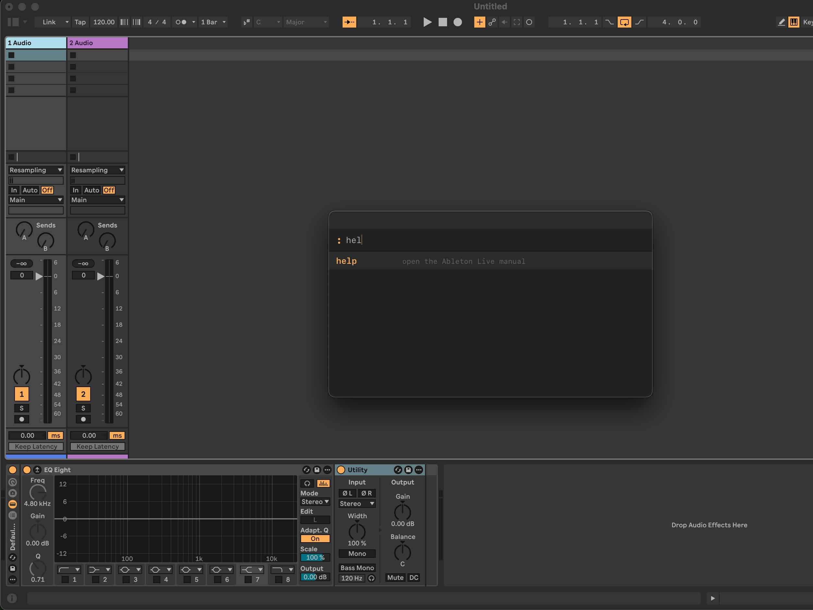

# cmdAbl

A command palette for Ableton Live.

Press `:` while Live is focused to open a
keyboard-driven command input with fuzzy filtering, tab completion, and POSIX-style flag arguments.
You are invited to add your own extensions as registered commands.

- [How it works](#how-it-works)
- [Installation](#installation)
- [Development](#development)
- [Scripts](#scripts)
- [Project structure](#project-structure)

<figure>

<figcaption>open the manual with help command</figcaption>
</figure>

---

<details id="how-it-works" open>
<summary><b>How it works</b></summary>
<br>

cmdAbl registers a persistent HTTP server inside the extension host. Karabiner Elements watches
for `:` while Ableton is frontmost and fires a `curl` request to that server, which opens the
command palette modal. Commands are registered in TypeScript and injected into the UI at open
time, so the palette always reflects the live command set.

**Palette keybindings**

| Key       | Action                                |
| --------- | ------------------------------------- |
| Type      | Filter commands / flags               |
| `Tab`     | Complete selected item into the input |
| `Enter`   | Execute selected command              |
| `↑` / `↓` | Navigate the list                     |
| `Esc`     | Close without executing               |

**Command syntax**

Commands follow a POSIX-style flag pattern:

```
commandName [--flag]
```

Typing a command name followed by a space switches the dropdown into flag-completion mode.

**Built-in commands**

| Command          | Description                                                           |
| ---------------- | --------------------------------------------------------------------- |
| `help`           | Open the Ableton Live manual in the browser                           |
| `cmdabl --setup` | Install the keyboard trigger rule and show a result dialog            |
| `suggest`        | Generate ghost-note suggestions for the selected clip _(coming soon)_ |
| `accept`         | Accept all ghost-note suggestions _(coming soon)_                     |
| `clear`          | Remove all ghost-note suggestions _(coming soon)_                     |

</details>

---

<details id="installation" open>
<summary><b>Installation</b></summary>
<br>

**Prerequisites**

| Platform | Required                                                                                               |
| -------- | ------------------------------------------------------------------------------------------------------ |
| macOS    | [Ableton Live 12](https://www.ableton.com) · [Karabiner-Elements](https://karabiner-elements.pqrs.org) |
| Windows  | [Ableton Live 12](https://www.ableton.com) · [AutoHotkey v2](https://www.autohotkey.com)               |

**1. Install the extension**

Download the latest `.ablx` file and double-click it — Ableton Live installs and loads the extension automatically.

**2. Open the palette**

Right-click any clip, track, clip slot, or scene and choose **: cmdAbl**.

**3. Set up the `:` keyboard shortcut — macOS**

Make sure [Karabiner-Elements](https://karabiner-elements.pqrs.org) is installed, then run the following command in the palette:

```
cmdabl --setup
```

A feedback dialog confirms whether the rule was linked or shows an error. Then open
**Karabiner-Elements → Complex Modifications → Add rule** and enable
**"Open cmdAbl command palette with ':' when Ableton Live is focused"**.

<video src="assets/images/readme/setup.mp4" controls width="80%"></video>

> **Keyboard layout note:** The rule maps `Shift+Period` (`:` on QWERTZ/German layouts).
> If you use a different layout, edit `karabiner/cmdabl.json` and change `"key_code"` to
> match your key — use Karabiner's Event Viewer to find the correct code.

**3. Set up the `:` keyboard shortcut — Windows**

Make sure [AutoHotkey v2](https://www.autohotkey.com) is installed, then run:

```
cmdabl --setup
```

A feedback dialog confirms the script was copied to your startup folder. Open `cmdabl.ahk`
manually to activate it immediately, or restart Windows to auto-start it.

</details>

---

<details id="development" open>
<summary><b>Development</b></summary>
<br>

**1. Install dependencies**

```sh
npm install
```

**2. Run the extension in dev mode**

```sh
npm start
```

This type-checks, bundles, and loads the extension into Ableton's Extension Host with live reload.

**3. Add commands**

All commands are registered on the `CommandRegistry` instance in `src/extension.ts`:

```ts
registry.register("mycommand", "description shown in the palette", (flags) => {
  // flags is string[] of everything typed after the command name
});

// with declared flags for tab-completion:
registry.register(
  "mycommand",
  "description",
  [{ name: "--option", description: "what this flag does" }],
  (flags) => {
    if (flags.includes("--option")) {
      /* ... */
    }
  },
);
```

Extensions must export an `activate(context: ActivationContext)` function.

</details>

---

<details id="scripts" open>
<summary><b>Scripts</b></summary>
<br>

```sh
npm start          # type-check, build (dev), and run in Live's Extension Host
npm run package    # production build + create a .ablx archive (includes karabiner/ and windows/)
```

</details>

---

<details id="project-structure" open>
<summary><b>Project structure</b></summary>
<br>

```
src/
  extension.ts       main entry point — registers commands, starts HTTP server
  commandRegistry.ts typed command registry with flag support
  httpTrigger.ts     localhost HTTP server for external triggers (Karabiner, AHK, etc.)
  setup.ts           platform-specific keyboard trigger setup (macOS + Windows)
ui/
  interface.html     command palette (self-contained HTML/CSS/JS, inlined at build time)
karabiner/
  cmdabl.json        Karabiner Elements complex modification (macOS)
windows/
  cmdabl.ahk         AutoHotkey v2 script (Windows)
assets/
  images/            screenshots and videos for this README
```

</details>
